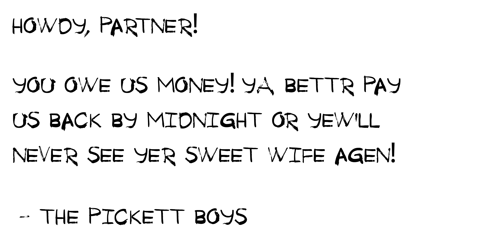

# unit-4-game_High-Noon-Heist

***

## In this nerve-wracking game of chance, you play an unnamed cowboy in the wild, wild west whose wife has been kidnapped by the dastradly Pickett Boys. Pay the ransom for your wife by stealing from the town sherrif while he takes his high noon nap. Do you have fast fingers and the guts to steal the sherrif's jewels right from unde his nose?

***

# Instructions

1.	Steal the jewels by clicking on them.

2.	When you click on the jewel, you will receive a specific amount of money.
                        
3.	You win the game and save your wife by matching the amount of money you’ve stolen to the ransom displayed in the bottom, left corner.

4.	If you take too much money, the sheriff will wake up and send you to jail. Game over.

5.	Each time the game starts, the value of the jewels and the ransom will change.  